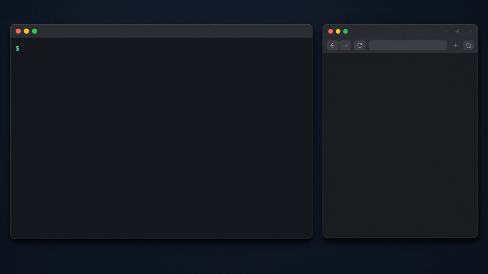

# localsaml

ローカル開発用の使い捨てSAML IdP。SPとユーザを1つのYAMLに書いておけば、**ログイン済みのブラウザ**がワンコマンドで開きます。デーモンもログイン画面もありません。

[English](./README.md)

```console
$ localsaml open myapp admin member
✔ myapp × admin   default browser
✔ myapp × member  default browser
```

標準ブラウザで2回ログインが開きます。セッションを分けて同時に保持する場合は `--isolated` を使います。



## なぜ作ったか

エンタープライズ向けにSAML SSOを売っていると、たいていそれは上位プラン限定の機能です。結果としてローカル開発では誰もSSOを使わず、みんなパスワードログインで代替し、**SAMLの経路はstagingで初めて踏まれる**ことになります。

その経路にあるのは、テナント割り当て・ロールマッピング・JITプロビジョニングです。手元のコードでいちばん壊れやすく、いちばん実行されていない場所です。

localsaml は、ローカルでSAMLログインを**いちばん楽な選択肢**にします。リリースごとに一度ではなく、毎日その経路が動くようにするためのものです。

## これは何で、何ではないか

**これは**、署名済みアサーションの生成器とブラウザ起動器を足したもの。ローカル開発専用です。

**これではない**もの: IdP。パスワードを聞かないし、SP-initiated SSOも実装していません。自分のマシン以外から到達できる場所に置かないでください。

小さいまま保つために、意図的にスコープ外にしているもの:

- **OIDC** — 別のツールの仕事です。これはSAMLをやります
- **本物のIdPへの接続** — これも別のツールです
- **SCIM** — いつかやるかもしれませんが、v1では対象外

## インストール

```console
npm install -g localsaml     # または: npx localsaml <command>
```

## クイックスタート

```console
$ localsaml add myapp
✔ Generated a key pair (once only — shared by every SP)
✔ Registered myapp

ℹ Configure your SP with these IdP values:

idp.entityId
urn:localsaml:idp

idp.ssoUrl
http://sso-not-used.localsaml.invalid/run-localsaml-open-instead

idp.metadataFile
~/.config/localsaml/config/idp-metadata.xml

certificate (PEM)
-----BEGIN CERTIFICATE-----
...
-----END CERTIFICATE-----
```

IdP情報をSP側に設定し、`myapp.yaml` の `CHANGE_ME_SP_ENTITY_ID` と `CHANGE_ME_ACS_URL` を対象アプリの値に書き換えます。

```console
$ localsaml edit myapp
$ localsaml show myapp       # IdP情報を再表示
```

設定できたら:

```console
$ cd ~/repos/myapp
$ localsaml open myapp
```

従来のように質問に答えて作る場合は `localsaml add myapp --interactive` を使います。

## 試す

このリポジトリには、約150行のNode製SP **`examples/demo-sp`** が入っています。自分のアプリに繋ぐ前に、セッションが張られる様子を最短で確認できます。

## 仕組み

`localsaml open` は、指定されたユーザ向けの署名済みSAML Responseを組み立て、`127.0.0.1` 上で**1回だけ応答する自動submitフォーム**を配り、OSの標準ブラウザで開きます。フォームがACS URLへPOSTし、SPがセッションを張り、CLIは終了します。ブラウザがフォームを取得しない場合も5秒で打ち切ります。

知っておく価値のある帰結が3つあります。

- **POSTはブラウザの中で起きる**ので、セッションCookieはそのブラウザのプロファイルに落ちます。Cookie注入もPlaywrightもヘッドレス工程も不要です
- **フォームは `file://` ではなく実オリジンのHTTPで配られます**。`Origin: null` で飛んできたフォームを拒否するSPがあるためで、同時にアプリから見てクロスサイトのPOSTになる — 本番とまったく同じ条件です
- `--isolated` を付けると従来どおり **SP × ユーザごとのChromiumプロファイル**で開き、セッションを分離できます

## ユーザ

ユーザは各SPのYAMLに、そのSPの設定と一緒に書きます。1ファイル見れば接続先とログインできるユーザがすべて分かります。属性は**意味**で書き、ワイヤ上の名前と `NameFormat` は preset が決めます。

```yaml
# ~/.config/localsaml/myapp.yaml
users:
  yamada:
    email: yamada@example.com
    familyName: 山田
    givenName: 太郎
    displayName: 山田 太郎
    department: 開発部
    employeeId: "10024"

  suzuki:
    extends: yamada          # 継承して差分だけ書く
    email: suzuki@example.com
    familyName: 鈴木
    givenName: 花子
```

使えるキー: `email` / `familyName` / `givenName` / `displayName` / `department` / `employeeId` / `groups`、加えて `nameId` / `nameIdFormat` / `to`。

### 「壊れているケース」もユーザとして書く

属性まわりのバグは、値がきちんと入っているときではなく、**欠けているとき・空のとき・複数あるとき**に出ます。だからそれらは一級市民であるべきです。

```yaml
  no-department:
    extends: yamada
    department: null          # 属性そのものを出さない
  empty-department:
    extends: yamada
    department: ""            # 属性はあるが値が空
  multi-department:
    extends: yamada
    department: [開発部, 基盤チーム]
```

`null` と `""` はワイヤ上で別物ですし、おそらくSP側の扱いも別物です。

### presetで表せないもの

presetがカバーしない属性は `raw` にそのまま書けます。無変換で出ます。

```yaml
  yamada:
    raw:
      - name: lastNameKana
        value: ヤマダ
      - name: costCenter
        value: "CC-4410"
        nameFormat: basic
```

ふりがな・社員番号・原価センターのような日本の現場固有の属性は、ここを通してください。

## サービスプロバイダ

```yaml
# ~/.config/localsaml/myapp.yaml
preset: okta

idp:                           # IdP識別子と署名ファイル
  entityId: urn:localsaml:idp
  metadataFile: /Users/you/.config/localsaml/config/idp-metadata.xml
  privateKeyFile: /Users/you/.config/localsaml/config/idp-key.pem
  certificateFile: /Users/you/.config/localsaml/config/idp-cert.pem
  ssoUrl: http://sso-not-used.localsaml.invalid/run-localsaml-open-instead

sp:
  entityId: http://localhost:3000/saml/metadata
  acsUrl:   http://localhost:3000/saml/acs

defaultUser: yamada

attributes:                   # このSPでは全ユーザに乗る
  raw:
    - { name: tenantId, value: t-001 }

users:                        # このSPでログインできるユーザ
  yamada:
    email: yamada@example.com
    familyName: 山田
    givenName: 太郎
    displayName: 山田 太郎
    department: 開発部
    groups: [admin]
  suzuki:
    extends: yamada
    email: suzuki@example.com
    familyName: 鈴木
    givenName: 花子
    displayName: 鈴木 花子
    groups: [member]
    to: /dashboard            # RelayState
```

SP側には `idp.entityId`、`idp.ssoUrl`、証明書（または `idp.metadataFile`）を設定します。`idp.privateKeyFile` はlocalsamlが署名に使うローカルファイルで、SP側には渡しません。

属性は2層で合成され、ユーザ個別の値が後勝ちになります。

```
attributes  →  users[名前]
```

`attributes` はテナントIDなど、そのSPの全ユーザに付与する値に使います。

## preset

同じユーザ定義が、4つのIdP向けにこう変わります。

| preset | `department` の名前 | NameFormat |
|---|---|---|
| `generic` | `department` | basic |
| `okta` | `department` | unspecified |
| `entra` | `http://schemas.xmlsoap.org/ws/2005/05/identity/claims/department` | uri |
| `shibboleth` | `urn:oid:2.5.4.11`（FriendlyName `ou`） | uri |

初回起動時に組み込みのpresetが `~/.config/localsaml/config/presets.yaml` へ書き出され、以後はそのYAMLが読み込まれます。既存ファイルは上書きされないので、属性名の変更や独自presetの追加ができます。

属性名だけでは足りません。SPは `NameFormat` も見ていて、**一致しないと無言で無視されます**。エラーにならないので原因にたどり着きにくい典型例です。presetは両方を面倒見ます。

presetはSPごとの設定なので、これを切り替えることで、本物のIdPでは答えられない問いに答えられます。**顧客がOktaからEntra IDに乗り換えても、うちのアプリは動くのか？**

```console
$ localsaml open myapp yamada --print | grep AttributeStatement -A20
```

## 設定の置き場所

既定ではすべて `~/.config/localsaml` に入ります。別の場所に置く場合は、環境変数 `LOCALSAML_CONFIG_PATH` で指定します。

SPとユーザの設定は、SP名のYAMLとしてルート直下に置きます。IdPの内部設定、鍵、証明書、メタデータは `config/` にまとめられます。

```text
~/.config/localsaml/
├── sample.yaml
└── config/
    ├── config.yaml
    ├── presets.yaml
    ├── idp-key.pem
    ├── idp-cert.pem
    └── idp-metadata.xml
```

`localsaml init` は初回に `sample.yaml` も生成します。必須の `sp.entityId` と `sp.acsUrl` は `CHANGE_ME_...` として生成されるので、対象アプリの値に書き換えてください。既存の `sample.yaml` は上書きしません。

```console
$ LOCALSAML_CONFIG_PATH=~/repos/localsaml-config localsaml init
```

`LOCALSAML_CONFIG_PATH` が未設定なら `~/.config/localsaml` を使います。

`--isolated` で作られるブラウザプロファイルは、常に `~/.config/localsaml/profiles/` に保存されます。

### チームで共有する場合

localsaml は個人用のツールです。チームで定義を揃えたければ、設定の保存先そのものをリポジトリにしてください。dotfilesと同じ発想です。

```console
$ export LOCALSAML_CONFIG_PATH=~/repos/localsaml-config
$ localsaml init
$ cd ~/repos/localsaml-config && git init
```

秘密鍵も一緒にコミットしてください。証明書が一致していて初めてSP側の設定値も共有できますし、このIdPを信用するのはあなたのローカルのSPだけなので、漏れて困るものはありません。

## コマンド

| | |
|---|---|
| `localsaml add <name>` | SPを登録する（初回は鍵と証明書も生成） |
| `localsaml open [sp] [user...]` | 1人または複数ユーザのログインを開始 |
| `localsaml list` | プロファイル名とSP Entity IDを一覧表示 |
| `localsaml show <profile>` | プロファイル名・パス、IdP情報、証明書を表示 |
| `localsaml edit <profile>` | `$VISUAL` または `$EDITOR` でSPプロファイルを開く |
| `localsaml remove <profile>` | SPプロファイルのYAMLを削除する（`rm` でも可） |
| `localsaml init` | 設定ディレクトリとIdPファイルを初期化する |

よく使うフラグ: `--to <path>`（RelayState）、`--print`（ブラウザを開かず署名済みResponseを出力）、`--isolated`（専用Chromiumプロファイル）、`--browser <path>`（`--isolated` を含む）。

`add` は既定で非対話です。質問に答えてSP設定を作る場合は `add --interactive`（`-i`）を使います。

`list` は一覧に特化した表示です。

```text
PROFILE    SP ENTITY ID
─────────  ────────────
localtest  http://localhost:4000/saml/metadata
sample     CHANGE_ME_SP_ENTITY_ID
```

詳細は `show <profile>`、編集は `edit <profile>` を使います。プロファイルが1つだけなら `open` でSP名を省略できます。複数ある場合は `open <profile> [user...]` のように明示します。

## 制約

小さく保つことの裏返しとして、正直に挙げておきます。

- **IdP-initiated専用**。生成されるメタデータのSSO URLでは何も待ち受けていません（プレースホルダであることがURL自体に書いてあります）。セッションが切れたら、リダイレクトを追うのではなく `localsaml open` を叩き直してください。SP-initiatedを喋るデーモンは、この先の自明な拡張方向です
- **分離モードはChromium系のみ**（Chrome / Edge / Brave / Chromium）。通常モードはOSの標準ブラウザを使います
- **SP側の設定を差し替えられることが前提**です。たいていは環境変数ひとつですが、そうでない場合もあります
- **SAMLのみ**。「これは何で、何ではないか」を参照してください

## うまくいかないとき

**SPが署名を拒否する** — たいていのSPは**アサーション**への署名を求めており、それが既定です。メッセージ側にも署名が要る場合は `sign: both` にしてください。`sign: response` 単独は、アサーションへの署名を必須とする大半のSPで失敗します。

**属性が空で届く** — ほぼ確実に `NameFormat` の不一致です。`localsaml open <sp> <user> --print` の出力と、SPが期待している形式を突き合わせてください。

**httpsのSPで証明書の警告が出る** — 通常は標準ブラウザで警告を承認します。分離モードではSP設定に `browser.isolated: true` と `browser.ignoreCertErrors: true` を入れられます。

## ライセンス

MIT
